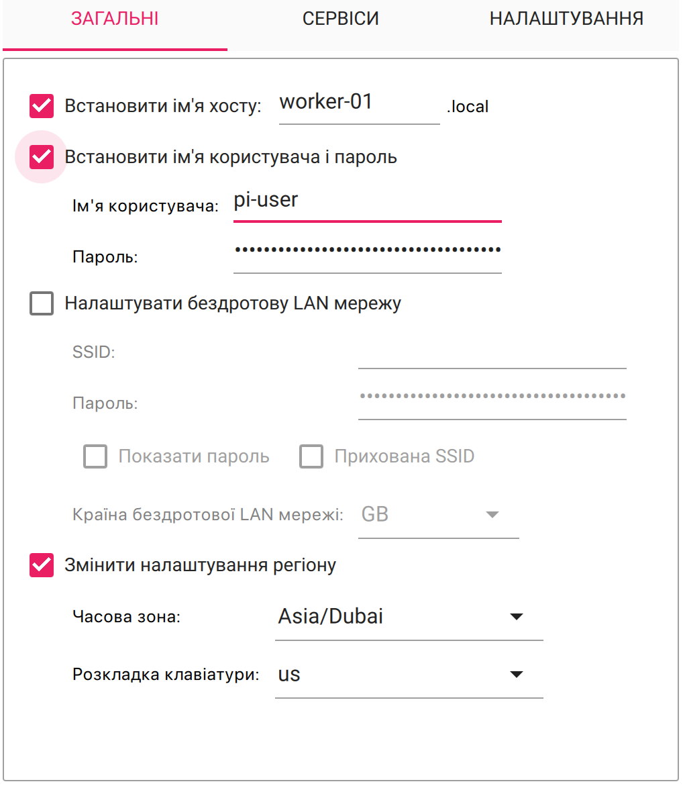
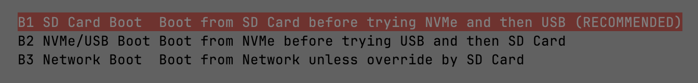

# Розгортання кластера на Raspberry Pi

Повна інструкція з розгортання K3s кластера на Raspberry Pi з автоматизацією через Ansible та управлінням інфраструктурою через Terraform.

> Цей документ описує як вручну налаштувати кластер. Для автоматизованого розгортання використовуйте [Ansible playbooks](/doc/ansible.md).

---

### Крок 1: Встановлення Raspberry Pi Imager

**Raspberry Pi Imager** — офіційна утиліта для підготовки носія. Доступна для **Windows**, **macOS** і **Linux**.  
Осьо тутички:  
https://www.raspberrypi.com/software/

---

### Що він робить?

- Завантажує образ **Raspberry Pi OS** (або інший)
- Пише його на **SD-карту** або **SSD**
- Дозволяє попередньо налаштувати:
    - **SSH**
    - **Wi-Fi**
    - **hostname**
    - **користувача + пароль**

---

### Крок 2: Генеруємо SSH-ключ

Шоб мати доступ до Pi по SSH одразу після першого запуску, треба згенерити SSH-ключ і додати його в конфіг при записі образу.

Як це зробити?

#### Якщо ти на Linux або macOS:
>Якщо ви на Windows, розбирайтеся самі...

У терміналі запускаємо:

```bash
ssh-keygen -t ed25519 -C "pi-cluster"
```
Коли запитає шлях — вводимо шлях, назву (наприклад k3s), ключ збережеться у ~/.ssh/k3s і ~/.ssh/k3s.pub.

Можна одразу додати ключ до ssh:
```bash
ssh-add ~/.ssh/k3s
```

Після цього відкриваємо файл ~/.ssh/k3s.pub, копіюємо його вміст.

Далі — готуємо образ OS з усіма налаштуваннями (Lite, SSH, Wi-Fi, hostname і цей ключ).

Приклад налаштувань:


---

### Крок 3: Заливаємо операційку на SD-карту або SSD

Тут все просто: беремо **Raspberry Pi OS Lite** і заливаємо на SD-карту або SSD.

> Якщо у вас **нові Pi** і **завантаження з SSD ще не увімкнене**, то ллємо спочатку на SD-карту — з неї й запустимось.
>
> Якщо ж Pi вже підтримує завантаження з SSD (наприклад, Pi 5 або правильно налаштована Pi 4), то можна **одразу лити на SSD** і **пропустити 5-6 кроки**.


---

### Крок 4: Перший запуск і оновлення EEPROM

Підключаємо SD-карту (SSD), вмикаємо живлення, чекаємо пару хвилин. Потім дивимось на роутері, яку IP-адресу отримала залізка.

> Можна одразу зробити IP **статичною**, та замінити на більш "зручну".

---

#### Крок 5: Перевірка та оновлення EEPROM

Перш ніж йти далі, переконайтесь, що у вас свіжа прошивка EEPROM — вона впливає на підтримку завантаження з SSD.

Підключаємося по SSH, далі оновлюємося:

```bash
sudo apt update
sudo apt full-upgrade
sudo reboot
```

Після перезавантаження перевіряємо EEPROM:
```bash
sudo rpi-eeprom-update
```

Якщо побачите, що є оновлення — застосовуємо:
```bash
sudo rpi-eeprom-update -a
sudo reboot
```

> Повторюємо для кожного Raspberry Pi в кластері.

---

### Крок 6: EEPROM вже все вміє — порядок завантаження чіпати не треба

Після оновлення EEPROM завантаження з USB/SSD вже за замовчуванням увімкнено — нічого додатково налаштовувати не треба.

> Раніше на **Raspberry Pi 4** треба було вручну міняти Boot Order через `raspi-config`, але тепер це не актуально.

Для довідки: ось як зараз це виглядає:



Поклацати можна тут:
```bash
sudo raspi-config
```

---

### Крок 6.1: Фіксимо проблеми з живленням USB (якщо Pi не стартує з SSD)

Якщо ви використовуєте не рідний блок (навіть з PD) і Pi 5 не стартує або перезавантажується, коли на USB підключений SSD чи інший “прожорливий” девайс — є просте рішення:

```bash
sudo raspi-config
```

Далі переходимо:

```
Performance Options → USB Current → Set USB current limit
```

Або через /boot/firmware/cmdline.txt

Відкриваємо конфіг:

```bash
sudo nano /boot/firmware/cmdline.txt
```

Додаємо (або змінюємо) рядок:

```ini
max_usb_current=1
```

> Це дозволяє подавати до **1.2A** на USB (замість стандартних 600mA).

Зберігаємо, перезавантажуємось.

> ! “Переконайтеся, що блок живлення справді тягне, бо можливо то не просто невдале PD-узгодження.”
---

### Крок 7: Ставимо обов'язковий мінімум для k3s

Щоб `k3s` ставився без глюків, треба трохи підготувати систему.

#### Встановлюємо `iptables`

Деякі образи Raspberry Pi OS Lite не мають його з коробки, тому ставимо руками:

```bash
sudo apt install -y iptables
```

---

#### Вимикаємо swap

```bash
sudo dphys-swapfile swapoff
sudo dphys-swapfile uninstall
sudo systemctl disable dphys-swapfile
```

А ще краще — прибрати запис про swap з `/etc/fstab`, якщо там є.

---

#### Перевіряємо `cgroup` (для Pi 4/5 зазвичай ок)

Виконуємо:

```bash
cat /boot/firmware/cmdline.txt
```

Перевіряємо, що там є `cgroup_enable=cpuset cgroup_enable=memory cgroup_memory=1`

Якщо ні — додаємо ці опції в кінець рядка і перезавантажуємо:

```bash
sudo nano /boot/firmware/cmdline.txt
```
Додаємо в кінець рядка (в один рядок, без переносу)

Зберігаємо і:
```bash
sudo reboot
```

---

### Крок 8: Встановлюємо `k3s` master-ноду

Будемо використовувати **[k3s](https://k3s.io/)** — легкий Kubernetes, який ідеально підходить для Raspberry Pi.

Ставимо master-ноду однією командою:

```bash
curl -sfL https://get.k3s.io | sh -s - --disable traefik
```

Статус сервісу можна перевірити так:

```bash
systemctl status k3s.service
```

> Я використовую **Ingress NGINX**, тому одразу прибираю `traefik`, шоб не заважав.


### Отримуємо токен для воркерів

Щоб підключити воркер-ноди до master, треба токен:

```bash
sudo cat /var/lib/rancher/k3s/server/node-token
```

Цей токен використовуватимемо на всіх Pi-нодах, які хочемо додати до кластеру.


### Конфіг Kubernetes

Одразу дивимось, де лежить `kubeconfig`, і адаптуємо його при потребі (наприклад, для доступу з іншої машини в мережі):

```bash
sudo cat /etc/rancher/k3s/k3s.yaml
```

> Просто змінюємо `127.0.0.1` на IP-адресу вашого Pi-master, і все буде працювати.

---

### Крок 9: Додаємо worker-ноду до кластера без Traefik

На `master`-ноді (де вже стоїть `k3s`), ми маємо IP та токен:

На новій worker-ноді запускаємо:

```bash
curl -sfL https://get.k3s.io | \
  K3S_URL=https://<IP_MASTER>:6443 \
  K3S_TOKEN=<NODE_TOKEN> \
  sh -
```

Статус сервісу можна перевірити так:

```bash
systemctl status k3s-agent.service
```
---

### Перевіряємо

```bash
kubectl get nodes
```

Тут має зʼявитися новий вузол зі статусом `Ready`.

> P.S. Грохнув свій кластер щоб то написати.

---

## Автоматизоване розгортання

Для автоматизованого розгортання кластера використовуйте Ansible playbooks:

### Швидкий старт
```bash
# Повне налаштування кластера
make full
```

### Поетапне налаштування
```bash
# 1. Підготовка Ubuntu системи
make setup-ubuntu

# 2. Налаштування моніторингу
make setup-influxdb
make setup-telegraf
make setup-dashboards

# 3. Встановлення K3s
make setup-k3s

# 4. Налаштування доступу до кластера
make setup-cluster-access

# 5. Розгортання інфраструктури
make apply
```

### Перевірка статусу
```bash
# Статус кластера
make cluster-status

# Перевірка підключення
make test-connection
```

### Оновлення системи
```bash
# Безпечне оновлення Ubuntu
make upgrade-ubuntu-safe

# Тільки оновлення безпеки
make upgrade-security
```

Детальніше про Ansible playbooks читайте в [документації](/doc/ansible.md).
